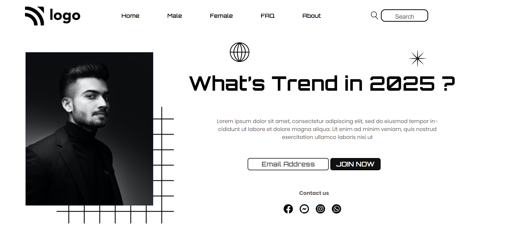

# 🔗Project 1

# 🌟 **Street Style Landing Page** 🌟

# 📌 **project Link***
[street_style_Landing_page](https://ankit110.github.io/Project_1_Street_Style_Landing_page/)

This project is an assignment given in **"JavaScript Full Stack Web Developer Bootcamp"** by **iNeuron**.

It is built using **HTML5** and **CSS3**

# 📌**Technology**

# 📸Thumbnail

# What I learn from this project:

- CSS Flexbox
- CSS Positioning
- CSS Selectors
- Applying CSS on targeted nested Elements.
- Design buttons.

